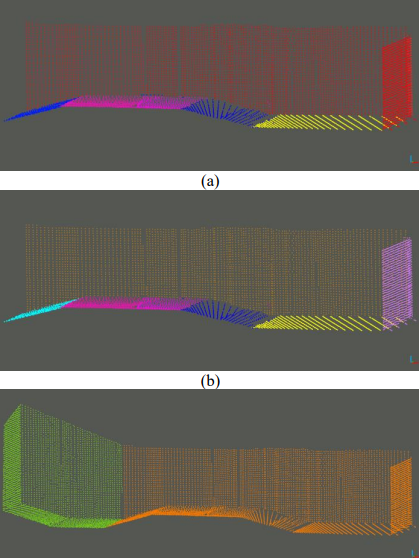

### What is Point Cloud

A point cloud is a collection of points in 3D space that represent the external surface or features of an object or environment. These points are typically generated by laser scanners, photogrammetry, or other methods of 3D scanning. Each point in the point cloud represents a coordinate in 3D space, and may also contain additional information such as color, reflectivity, or intensity.

Point clouds are often used in fields such as computer graphics, robotics, and virtual reality, as well as in various engineering applications such as architectural design, construction, and surveying. They can be processed and analyzed using specialized software to extract useful information, such as object dimensions, surface curvature, or other features of interest.

### About This Repository

This repository presents an implementation of point cloud data operations in C++ using data structures to facilitate efficient processing. The implementation includes plane segmentation techniques utilizing RANSAC and Region Growing algorithms. Additionally, this repository provides examples of building semantic maps using point cloud data and visualizations.

  

 

### Use Cases

The utilization, alteration, and dissemination of the code contained within this repository are permitted, provided that appropriate attribution is given to the repository as the original source.
